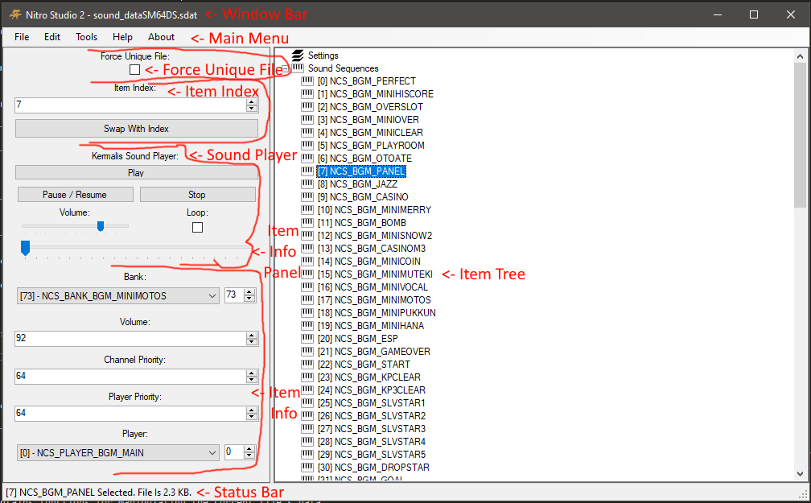
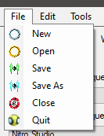
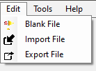
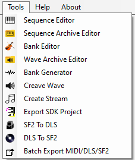
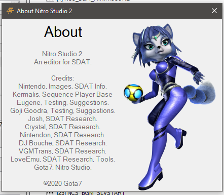
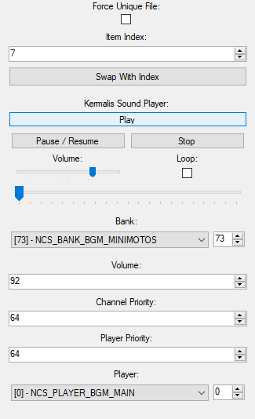
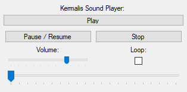
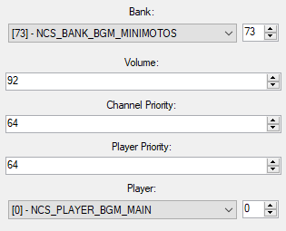

<link rel="shortcut icon" type="image/x-icon" href="../favicon.ico">

# General Editor Controls
This section describes the general controls of Nitro Studio 2 that are fairly consistent throughout the editor.

## Window Components
A window in Nitro Studio 2 consists of a few components.

### Window Bar
Contains the name of the editor and the name of the file being currently edited.

### The Main Menu
The main menu is at the very top of Nitro Studio 2 and contains many essential functions for managing the current file.

#### File Menu
The file menu contains functions that are used for setting the current file.

New - Close the file you are currently working on, and start a new blank file.

Open - Close the file you are currently working on, and open a file on your drive.

Save - Save the file you are currently working on. This does not save the parent file however. For example, saving a Bank inside a Sound Archive will only save the Bank and not the Sound Archive. Make sure you save any parent files afterwards if needed.

Save As - Close the file you are currently working on, but save the data to a new file somewhere on your drive and open it.

Close - Close the file you are currently working on.

Quit - Quit the editor you are currently using.

Whenever you are closing a file, the editor will alert you.

This warning will appear regardless or not if the file you are editing is up to date.

Save And Close - Save the file and close.

Close - Close the file without saving.

Cancel - Cancel the current action.

Please note that whenever a file is closed, you are no longer editing any files contained within the Sound Archive. You can only use the editors to edit and save files to your drive once the file being editing from inside the Sound Archive is closed. The only way to open a file inside an editor from the Sound Archive is to double click its entry in the item list. See the section below about the items for more info.

#### Edit Menu
The edit menu contains functions for manipulating the current file's data.

Blank File - Remove all the data from the file, essentially making it just like a new file.

Import File - Replace the current file's data with data from another file. This allows you to copy data from other files.

Export File - Export the current file's data to a file. This allows you to save the file's data without having to close it and open the written file.

#### Tools Menu
This menu is only available in the Main Window, but it contains tools to use for editing or creating files. It has some useful tools in there as well.

Sequence Editor - Editor for Sequence files.

Sequence Archive Editor - Editor for Sequence Archive files.

Bank Editor - Editor for Bank files.

Wave Archive Editor - Editor for Wave Archive files.

Bank Generator - Tool to create a new Bank from instruments from other Banks.

Create Wave - Create a Wave file and be able to control the output audio encoding.

Create Stream - Create a Stream file and be able to control the output audio encoding.

Export SDK Project - Export the Sound Archive to an SDK project that can be edited with NITRO-SoundMaker.

SF2 To DLS - Convert an SF2 (sound font) file to a DLS (downloadable sounds) file.

DLS To SF2 - Convert a DLS (downloadable sounds) file to an SF2 (sound font) file.

Batch Export MIDI/DLS/SF2 - Export all Sequences to MIDI and all Banks to DLS and SF2.

#### Help Menu
The help menu is used to recieve help.

Get Help - Links to the guide section of Nitro Studio 2's website.

#### About Menu
Display information about the program.

About Nitro Studio 2 - Shows this about window for Nitro Studio 2:

### Item Info Panel
The Item Info Panel contains information relevant to the currently selected item.

#### Force Unique File
If for the currently selected item, the file should be written as its own unique entry in the Sound Archive, even if the Sound Archive could be optimized by referencing a file with identical data instead. When in doubt, leave this unchecked so Nitro Studio 2 optimizes the files in the Sound Archive as efficiently as possible.

#### Item Index
The index for the current item. A new index can be entered for the item, and then the Swap With Index button pressed to assign the item the new index, and have the previous item with that index use the original item's index if one with such an index exists. In simpler terms, it will swap the indices of items, or just assign a new one if one with the entered index doesn't exist.

Item Index - The item index, or new index to assign to the item.

Swap With Index - Assign the selected item to the entered index, and if an entry exists with that new index, give it the selected item's old index.

#### Sound Player
The Sound Player is used to play Sequences, Sequences inside of Sequence Archives, or Waves inside of Wave Archives.

Play - Play the sound from the start.

Pause/Unpause - Pause or resume the sound playback.

Stop - Stop the sound playback.

Volume - Volume of the audio playback.

Loop - If the playback should loop if the sound loops.

Trackbar - The position of the current sound's playback.

#### Item Info
The item info varies for the type of item selected, and depends on the editor being used as well. For detailed information about all the different item infos for the Sound Archive, please read the next chapter.

### Item Tree
The Item Tree contains a list of all the different items contained in the current file being edited.

### Status Bar
The status bar displays information about the currently selected item, such as index, name, and file size. Its implementation varies for each editor.

## Item Tree Controls
The Item Tree contains its own controls.

### Space Bar
Pressing the space bar on your keyboard when an item that can play sound is selected will play that item's sound.

### Double Clicking
When an item is double clicked, its file will be opened in an editor or previewer of some sort. Nothing will happen if the item does not have a file. Since Sequence Archives also serve as parent nodes in the Item Tree, they are not ideal to double click. Therefore, a button to open the Sequence Archive's file is presented on the Item Info Panel.

### Right Click Menu
When you right click an item, you will be presented a list of functions that apply to that particular item. An item can have any of the following options in its right click menu:

Add - Add an item inside of the root node. This option only appears for root nodes.

Expand - Expand the list of items inside the selected node. This option only appears for root nodes.

Collapse - Hide the list of items inside the selected node. This option only appears for root nodes.

Add Above - Add an item of the same type of the item selected above the item selected. This option only appears for non-root nodes.

Add Below - Add an item of the same type of the item selected below the item selected. This option only appears for non-root nodes.

Move Up - Move the selected item up. This option only appears when editing Wave Archives, as Wave indices can not be set any other way.

Move Down - Move the selected item down. This option only appears when editing Wave Archives, as Wave indices can not be set any other way.

Replace - Replace the selected item's file with one on your drive. This option only appears for items that have files.

Export - Export the selected item's file to your drive. This option only appears for items that have files.

Rename - Rename the entry. This option only appears for items that have names.

Delete - Delete the entry. This option only appears for non-root nodes.

## Next
Now that you know how the editor is laid out, it's time to move on to:

[Sound Archive General Structure](soundArchive.md)