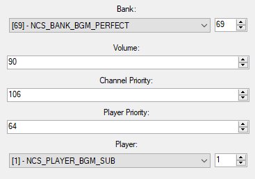
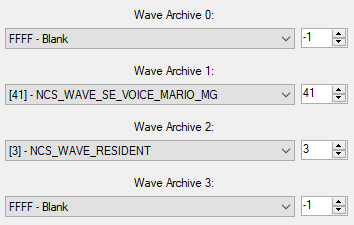
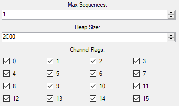
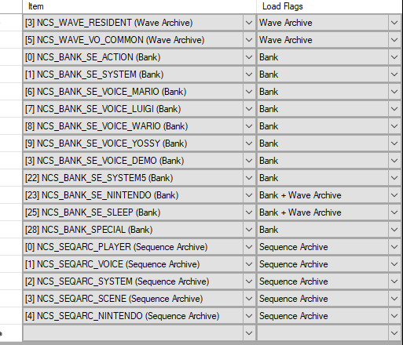
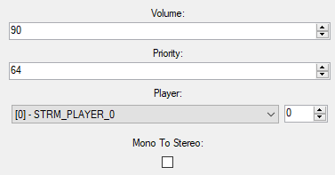

# Sound Archive General Structure
All music, sound effects, and anything audio related that use the Nitro SDK for audio store everything in what is called a Sound Archive. A Sound Archive can contain items such as Sequences, Banks, Players, Streams, and more.

## The General Playback Idea
There are two main methods of playing back audio: streamed audio or sequenced audio.

### Streamed Audio
Streamed audio is the simplest and most straightforward, but it's costly in memory and so is only usually used for sound effects or cutscenes. It simply has a streamed audio file, and plays it through a Stream Player. There's not much too it. A Stream file is kind of like a WAV file, but for the DS.

### Sequenced Audio
The easiest way to think of sequenced audio is to think of an MIDI file. An MIDI file just tells the device what notes to play, and Sequences do the same thing. Since Sequences play notes only, they must get the instrument data somewhere. This is where Banks come in, they tell the Sequence how to play notes. Sequences are thus hooked up to Banks. But Banks just tell the Sequence how to play a note, they don't actually contain any sound themselves. This is where Wave Archives come in. Wave Archives are like folders of WAV files, and Banks can use up to 4 of them to read sound data. The Sequence is then played through a Sequence Player.

## Individual Items
This section lists all the individual items a Sound Archive has. Two things are common between an item of any type though, and that is it has a name and an index. While games ignore names, items referenced within the Sound Archive itself and games use the index/id to refer to it. For example, a Bank will reference Wave Archive 5 instead of what the true name is. Please note that no two items of the same type will ever share the same index, and indices do not have to be sequential. For example, it is possible to have a Wave Archive with index 3, and a Wave Archive with index 5, but not one with index 4. In Nitro Studio 2, you will see an item's index in brackets to the left of its name.

An important thing to note is that is the Sound Archive that links items together. A Sequence file on its own has no idea what Bank to use, but its entry in the Sound Archive tells it what Bank to use.

### Sequences
A Sequence is like an MIDI file that tells the instruments what notes to play and when. It's information looks like this:

> Bank - What instrument Bank to use with the Sequence.
> Volume - A value from 0 to 127 representing the volume of the sequence. Divide this value by 127 and square it to get the actual volume percentage.
> Channel Priority - In the case that another sound is using the same channel, the one with the higher priority will play.
> Player Priority - In the case that the player is playing the max number of sequences, the one with the higher priority will play.
> Player - Which player to play the Sequence through.

### Sequence Archives
Sequence Archives are like Sequences, except that they have multiple entry points that start at different locations. They are mainly used for sound effects. They have no info to edit.

### Banks
Banks contain instruments that tell Sequences how to play notes. They are linked up to Wave Archives that contain the actual sound data.

> Wave Archive 0 - What Wave Archive to use for slot 0 for the Bank's instruments (instruments reference samples by slot and wave number).
> Wave Archive 1 - What Wave Archive to use for slot 1 for the Bank's instruments (instruments reference samples by slot and wave number).
> Wave Archive 2 - What Wave Archive to use for slot 2 for the Bank's instruments (instruments reference samples by slot and wave number).
> Wave Archive 3 - What Wave Archive to use for slot 3 for the Bank's instruments (instruments reference samples by slot and wave number).

### Wave Archives
Wave Archives contain audio samples to be used for instruments.

> Load Individually - If only the necessary waves in the Wave Archive are loaded instead of the whole thing.

### Sequence Players
Sequence Players play Sequences.

> Max Sequences - The maximum number of Sequences the player can play at a time.
> Heap Size - A value in hexadecimal of how much memory should be reserved for the player.
> Channel Flags - Which channels are allowed to be used by the Sequences (unchecked means Sequence won't use it).

### Groups
Groups are used for loading items. It is common to do something such as load a group per level. It is very inefficient to have everything loaded at once, or having certain items hardcoded to load. Groups allow a way for the game to load the necessary files for sequence playback on a level or instance basis. Note that if say a Wave Archive needed by a Sequence for a level isn't loaded due to it not being in the level group, that Sequence will fail to play. How groups are used to load items depends on the game.

> Item - The item to have loaded.
> Load Flags - What dependencies of the item to have loaded. For example, it is possible to have a Sequence Entry and only load its Bank and Wave Archives, or just load the Sequence itself, or any combination of these.

### Stream Players
Stream Players play streams.

> Channel Type - If the player is to play stereo or mono Streams.
> Left Channel / Channel: If the stream is stereo, what channel to use for the left channel of the Stream. If mono, it is simply just the channel to use.
> Right Channel: What channel to use for the right channel of the Stream.

### Streams
Streams are like WAV files for the DS. Since they take a lot of memory, they are only usually used for sound effects or cutscenes.

> Volume - A value from 0 to 127 representing the volume of the sequence. Divide this value by 127 and square it to get the actual volume percentage.
> Priority - In the case that the channels are busy, the higher priority item will play.
> Player - Which player to play the Stream through.
> Mono To Stereo - If the Stream is mono, convert it to stereo by playing it through both the channels of the Stream Player.

### Closing
Now that you understand the basic layout of the sound archive, it's time to move on to:

[General Editor Controls](404.md)